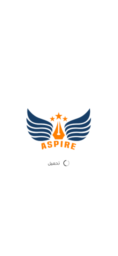
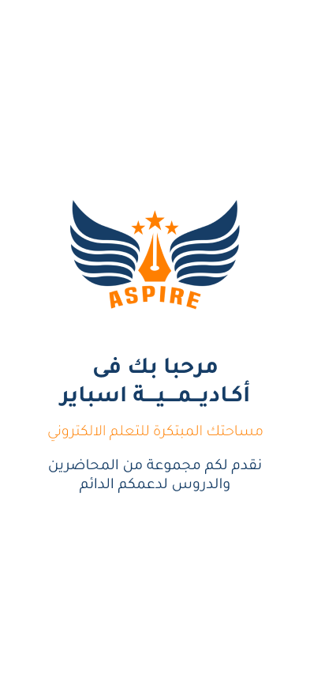
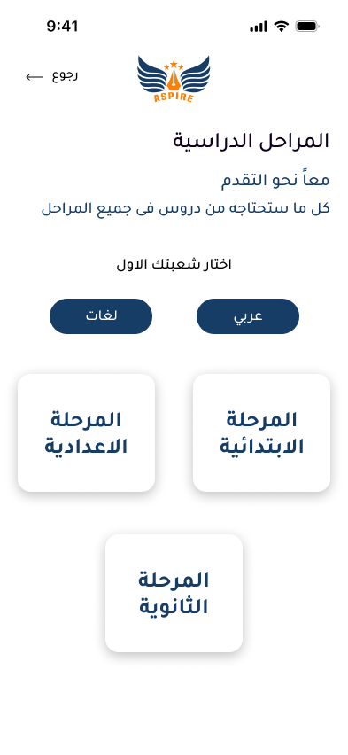

    <h1 align='center'><i>Aspire Academy Project</i></h1>
   

<h2 style="display:inline">📝 Table of Contents</h2>

- [⛏️ Built With](#built-with)
- [🏁 Getting started](#getting-started)
- [📦 Packages used](#packages-used)
- [📷 Features](#features)
- [✍️ Contributors](#contributors)
- [🔒 License](#license)

<h2 href="#built-with">⛏️ Built With : </h2>
 <ul>
    <li><a href="https://dart.dev/">Dart</a></li>
    <li><a href="https://flutter.dev/">Flutter</a></li>
 </ul>

<h2 href="#packages-used">📦 Packages used : </h2>
 <ul>
  <li>shared_preferences:</li>
  <li>dio:</li>
  <li>bloc:</li>
  <li>flutter_bloc:</li>
  <li>animated_splash_screen:</li>
  <li>flutter_svg:</li>
  <li>font_awesome_flutter:</li>
  <li>carousel_slider:</li>
  <li>google_fonts:</li>
  <li>dots_indicator:</li>
  <li>flutter_screenutil:</li>
  <li>smooth_page_indicator: </li>
  <li>google_mlkit_text_recognition:</li>
  <li>permission_handler: </li>
  <li>intl: </li>
 </ul>

## 📷 Features

<h3 style="display:inline">
<strong><em>⚡️Splash Screens & Home Screene</em></strong></h3>

   
   
   
   

<h3 style="display:inline">
<strong><em>🏠 Home</em></strong></h3>

   

<h3 style="display:inline">
<strong><em>👨‍👧‍👦 Father Follow </em></strong></h3>

   
   
   
   
   
   
   
   

<h3 style="display:inline">
<strong><em>👦👧 Children Login </em></strong></h3>

   
   
   
   
   
   

<h3 style="display:inline">
<strong><em>💵 ADD Money </em></strong></h3>

   
   
   
   

<h3 style="display:inline">
<strong><em>💸 Transfer Money </em></strong></h3>

 
   
   
   
   

<h3 style="display:inline">
<strong><em>💰 Wallet</em></strong></h3>

 
   
   
   
   

<h3 style="display:inline">
<strong><em>💳 Smart Card </em></strong></h3>

   
   
   

<h3 style="display:inline">
<strong><em>📇 Scan National ID </em></strong></h3>

   

<h2 href="#Contributors">✍️ Contributors</h2>
<table>
  <tr>

<td align="center">
<a href="https://github.com/BudaSamir" target="_black">
 <b>AbdulRahman Samir</b></a> 
</td>

 <td align="center">
<a href="https://github.com/NourhanHamada" target="_black">
 <b>Nourhan Hamada</b></a> 
</td>
</tr>
</table>

## 🔒 License 

> This software is licensed under MIT License, See [License](https://github.com/CMP24-SWE-TEAM3/Backend/blob/main/LICENSE) .

